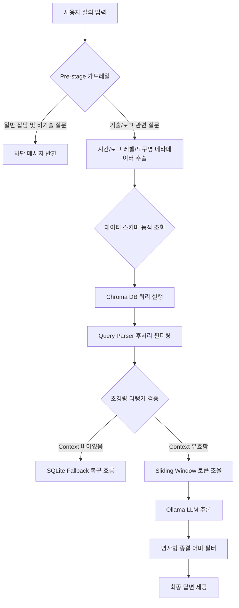

# 📋 서브에이전트용 RAG 시스템 구축 및 무결성 검증 가이드 (Strict RAG Protocol) - Human Docs

## 🎯 1. 목적
본 문서는 Logmon 시스템 내 RAG(Retrieval-Augmented Generation) 시스템 구축 및 유지보수 시 발생할 수 있는 임의적 추정(Hallucination)과 하드코딩으로 인한 연쇄적 시스템 오작동을 차단하기 위해 수립된 엄격한 검증 가이드라인입니다. 개발자와 매니저는 본 가이드라인에 명시된 설계 원칙과 자원 제어 방안을 숙지하여 시스템 무결성을 완벽하게 보장해야 합니다.

---

## 🧱 2. 시스템 구조 및 데이터 흐름 (Flow)

RAG 시스템은 아래와 같은 엄격한 3단계 필터링 및 검증 단계를 거쳐 흐름을 제어합니다.

---

## 🖥️ 3. 상세 화면 및 인터페이스 UX 정책
- **응답 레이아웃**: RAG 챗봇 엔진의 답변은 항상 구조화된 마크다운 포맷으로 통일하여 가독성을 높입니다.
- **예외 발생 시 사용자 피드백**:
  - LLM 모델 오프라인 및 통신 지연 시 사용자가 무한 대기 상태에 빠지지 않도록 프론트엔드 API 타임아웃을 180초로 유지합니다.
  - LLM 장애 상황 시 백업 장부(SQLite) 분석 결과를 포맷팅한 Simulated Response를 제공하여 대화 단절을 최소화합니다.

---

## 💾 4. 데이터 명세 및 무결성 설계
RAG 6대 설계 원칙을 데이터 수집 및 연산 관점에서 구조화합니다.

### 1) 데이터 스키마 및 메타데이터 동적 검증
- 데이터 적재, 필터링, 집계 쿼리를 작성할 때 고정 관념으로 메타데이터 조건을 상수로 박아서는 안 됩니다.
- 반드시 실행 시점에 `SELECT DISTINCT event_type, source_tool FROM ...` 등의 쿼리를 선행하거나 데이터를 동적으로 파싱하여 DB에 실제 적재된 물리적 카테고리를 먼저 파악한 후 연산 로직을 전개해야 합니다.

### 2) 인프라 종속성 배제 및 KST 타임스탬프 명시적 주입
- 도커 컨테이너의 `TZ` 환경 변수나 DB 커널의 자체 시계 기능에 의존하지 않습니다.
- 타임존은 파이썬 애플리케이션 단에서 `datetime.now(timezone_kst)`를 사용하여 명시적으로 통일합니다.
- SQLite `BETWEEN` 등 날짜 범위 검색 시 문자열 대소비교 누수가 없도록 시/분/초가 꽉 찬 풀 타임스탬프 포맷(`%Y-%m-%d %H:%M:%S`)으로 보정된 매개변수를 주입해야 합니다.

### 3) 자원 반납의 강박적 2중 가드
- 모든 DB 핸들러 및 쿼리 진입점은 무조건 `with get_connection() as conn:` 형태의 컨텍스트 매니저를 사용하거나, `try - except - finally: conn.close()` 구조를 적용하여 커넥션 누수를 차단합니다.
- 어떠한 조기 탈출(Early Return, Exception) 분기에서도 커넥션이 닫히도록 100% 보장해야 합니다.

### 4) 대량 청크 연산 전용 대형 HTTP 타임아웃 확장
- RAG 통신을 담당하는 HTTP 클라이언트(requests, httpx, aiohttp) 생성 시 타임아웃 설정을 절대 생략하거나 짧게 잡아서는 안 됩니다.
- 대량 데이터 연산 압박을 견딜 수 있도록 최소 `timeout=60.0` 이상으로 확장하거나 명시적으로 타임아웃 가드를 무력화(`timeout=None`)하여 네트워크 크래시를 원천 차단합니다.

### 5) 자연어 기간 파서의 입력 값 정제 및 정규식 무결성 검증
- 질문 문장의 공백 제거 등 전처리가 이루어진 문자열 변수와 정규식 매칭 타깃 변수의 일치 여부를 교차 검증해야 합니다.
- 파싱 실패 시 런타임 에러를 방지하기 위해 구조적 존재 여부 가드(`if min_timestamp and " " in min_timestamp:`)를 2중으로 쳐서 백엔드 500 에러를 방어해야 합니다.

### 6) 외부 라이브러리 원격 불필요 통신 원천 차단
- 백엔드 및 도커 인프라 초기화 시 시스템 환경 변수에 `ANONYMOUS_TELEMETRY=False`를 강제로 주입하여 불필요한 아웃바운드 네트워크 지연 요소를 원천 제거합니다.

---

## 🚨 5. 구현 제약 조건 및 협업 프로토콜
서브에이전트와 매니저 AI는 아래 3단계 샌드박스 프로토콜을 준수해야 합니다.
1. **[1단계: 전제 조건 락]**: 위의 6대 무결성 원칙을 프롬프트 컨텍스트에 박아두고 감시 가드를 가동합니다.
2. **[2단계: 원라이너 실측]**: 시스템에 문제 발생 시 현장 분석용 `grep` 또는 도커 로그 명령어를 사출하여 실측을 먼저 진행합니다.
3. **[3단계: 콤팩트 막타]**: 실측된 물증을 기반으로 불필요한 서술 및 사설을 모두 배제하고 수정 대상 파일의 정답 코드 블록만 정확하게 출력합니다.
